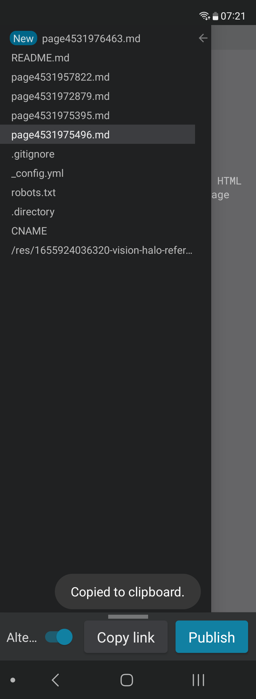
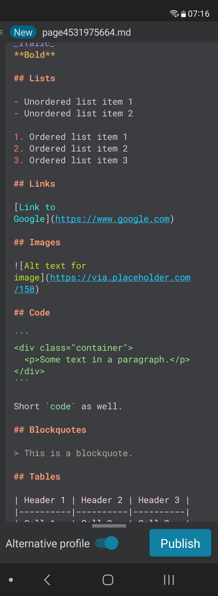
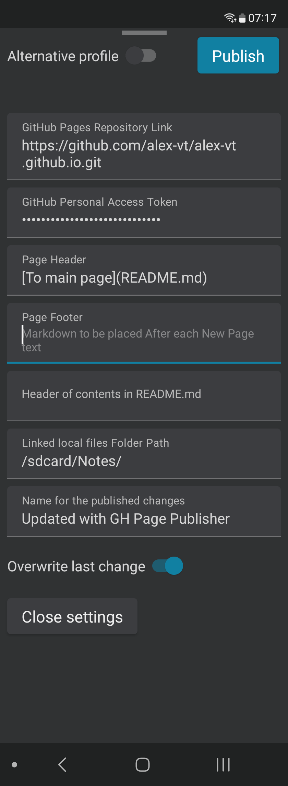
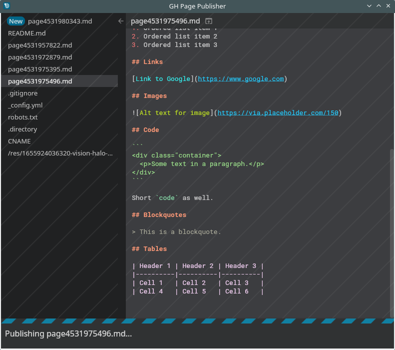

# GH Page Publisher

One-shot publishing app for Markdown text to GitHub Pages from Android and desktop. Paste Markdown and click Publish.

[](example/example1.png)
[](example/example2.png)
[](example/example3.png)

* Preview & edit syntax-highlighted Markdown before hitting Publish.
* Linked local files are uploaded as well.
* Already published pages are on the sidebar - click to view & edit.
* Settings are on the bottom bar - slide up to see all.
* New pages can be listed on index page under header specified in settings.
* Switch between two different GitHub Pages setups.
* Browse and copy links to published pages.

_Note: GitHub Pages website may take a minute to get your changes ready to view._

[](example/example4.png)

Pages sync with GitHub as soon as a page is viewed.
Content out of sync (loading or error) is crossed out.


## Build & run

Get source code for all target platforms below:
```
git clone https://github.com/alex-vt/GH-Page-Publisher.git
cd GH-Page-Publisher
```

### Android

Requirements: Java, Android SDK

Signing setup:
* Put your `keystore.jks` to the project's root folder for signing the app.
* Create a `signing.properties` in the project's root folder with `keystore.jks` credentials:
```
signingStoreLocation=../keystore.jks
signingStorePassword=<keystore.jks password>
signingKeyAlias=<keystore.jks alias>
signingKeyPassword=<keystore.jks key password>
```
#### Run on ADB connected device:
```
./gradlew installRelease
```

#### Build installable APK
```
./gradlew assembleRelease
```
Install `build/outputs/apk/release/GH-Page-Publisher-release.apk` on Android device.

On first run, the app will request enabling all files access, for locating and uploading files linked from new pages when they are published.

### Desktop Linux

Requirements: Java

#### Run on desktop:
```
./gradlew run
```

#### Build executable:
```
./gradlew createDistributable
```
Folder with the app will be `build/compose/binaries/main/app/GH-Page-Publisher`

To run the app, in the app folder execute `bin/GH-Page-Publisher`


## Initial setup

When started for the first time, the app needs info where to publish to. Slide up the bottom bar for the settings forms about your GitHub Pages to fill in. See [example](example/example3.png).

An alternative profile with its own separate settings can be made, there is a switch for it on the bottom bar.


## Development

Build system: Gradle

Stack: Kotlin, Jetpack Compose Multiplatform

Target platforms: Android, Desktop


## License

[MIT](LICENSE) license.
